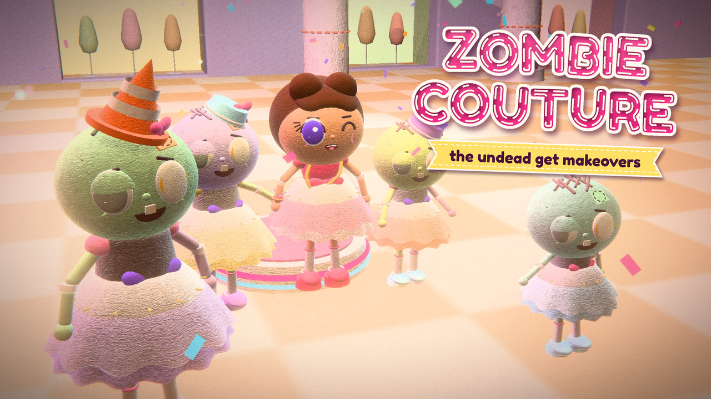

# Zombie Couture



A music video where a dead, grey mall is sewn back into pastel colour by a pink stitch front, one zombie makeover at a time. Everything you see is a procedural three.js world (lit felt, thread, embroidered type) rendered frame by frame in headless Chromium and timed to the song by an audio-analysis pipeline. The film loads no image or video files, only JSON timing data and one font: every frame is a function of the song time `t`.

## Try it

Needs Node with npm (to fetch three.js), Python 3.10+, ffmpeg, and `pip install playwright numpy pillow scipy contourpy` followed by `playwright install chromium`.

```bash
npm install                                            # three.js
# one still (style, scene, output, width, height, query)
python3 tools/shoot.py felt story out/still.png 1280 720 "t=8.9"
# a 10 second clip of the 10 s test scene; --on 2 renders every second frame and repeats it ("on twos"), the film itself renders every frame
python3 tools/farm.py --scene story --t0 0 --t1 10 --fps 24 --on 2 --w 1280 --h 720 --out out/frames/test --fmt jpg
# frames and a song to a checked mp4 (BT.709, one audio mux, faststart)
tools/encode_review.sh out/frames/test song.wav out/test.mp4
```

Software WebGL is slow: a 720p frame takes seconds. The farm is resumable, so a crashed or stopped run continues where it stopped.

## How it works

1. `analysis/run_audio.sh song.mp3` separates the vocal, aligns the lyrics word by word, finds beats, bars and sections, and writes `data/timing.json`.
2. `tools/make_shots.py` resolves `data/storyboard.json` against that timing into `data/shots.json`; every cut lands on a beat or a sung word.
3. `web/` draws the world: a frame is a pure function of `t`, so any frame can be rendered alone, in any order, by any process.
4. `tools/farm.py` renders the frames in headless Chromium (retries, browser restarts, heartbeat supervision, atomic writes); `tools/render_all.sh` has the presets.
5. `tools/encode_*.sh` build the mp4 with the audio muxed once, and `tools/mux_check.py` checks frame count, colour tags and audio length before anything is uploaded.

`docs/` has the details: `TREATMENT.md` (story and look), `ENGINE.md` (files, tools, cost), `FILM.md` and `FILM_RUNTIME.md` (the film runtime and its frame contract), `SHOTLIST.md` (every shot as built), `TIMING_SCHEMA.md`, `PUBLISHING.md` (frames to upload), `NEXT.md` (where the work stands, the farm commands, known soft spots and what was fixed late), `PRIOR_ART.md`.

## Credits

* Directed and published by Avenrae / ShaeAI
* Lyrics: Syribeth & ShaeAI
* Music: Suno v5
* Animation and every line of code: Claude Sonnet 5.5, in Claude.ai

## Licence

The code is MIT, see `LICENSE`. The Fredoka One font in `assets/` is under the SIL Open Font License 1.1 (`assets/OFL.txt`). Other dependencies are listed in `THIRD_PARTY_NOTICES.md`. The song and the finished film are not part of this repository, and neither they nor the lyrics are covered by the MIT licence.
