<p align="center">
  
</p>

<h1 align="center">Zombie Couture</h1>

<p align="center"><b>A music video that is also a program.</b><br>
A dead, grey mall is sewn back into pastel colour by a pink stitch front, one zombie makeover at a time.<br>
Every frame is drawn by code (lit felt, thread, embroidered type) and cut to the song by an audio-analysis pipeline.</p>

<p align="center"><a href="#the-film-in-numbers">Numbers</a> · <a href="#gallery">Gallery</a> · <a href="#how-it-was-made">How it was made</a> · <a href="docs/MAKING_OF.md"><b>Full making-of</b></a> · <a href="#run-it">Run it</a> · <a href="#credits">Credits</a></p>

---

The film loads no image, video or 3D-model file. Pip, the zombies, the mall, the thread and the lettering are built from geometry and shaders when the page opens; the only assets are one font and JSON data (the song's timing and the shot list). A frame is a pure function of the song time `t`, so the film is a program you can ask for any moment of, in any order. The picture above is frame 1,205 of it (0:50), with a tagline and a label added.

## The film in numbers

| | |
|---|---|
| Length | 177 s: the 171.02 s song plus a 6 s care-label end card |
| Picture | 4,248 frames, 1920×1080, 24 fps, every frame rendered |
| Edit | 81 shots built from 75 shot templates; 80 cuts, each on a beat or on a sung word |
| Assets loaded | none: no textures, models or video; one font and JSON data |
| Code | about 22,300 lines: 11,100 JavaScript (the world and the film runtime), 10,400 Python and 760 shell (audio analysis, the edit resolver, the render farm, QA, encodes) |
| Cast | Pip and a pool of 16 zombies in 7 variants; 61 procedural acting moves; an 8-shape mouth rig driven by the sung words |
| Song analysis | 126.18 BPM, 10 sections, 242 lyric words each timed to the recorded vocal |
| Render | headless Chromium on software WebGL (no GPU), 2 CPU cores, 7 to 12 s per 1080p frame: an overnight job |
| Look | wool felt generated in code (fibre texture, bump, mottling, fuzz rim), stitched seams, tilt-shift and bloom |

## Gallery

Stills from the finished film, in order. The notes in italics say what to look at.

<table>
<tr>
<td width="50%" valign="top">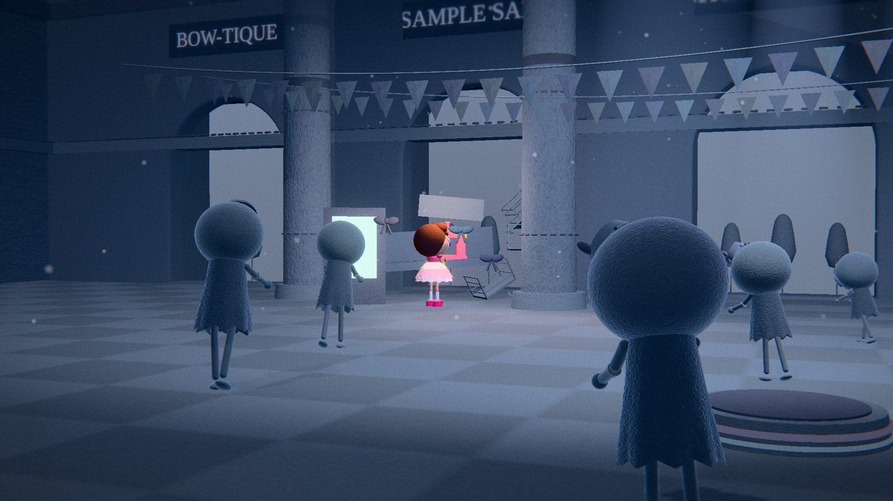<br><sub><b>0:01 · The dead mall.</b> Cold, grey, flickering, nearly colourless. Pip at her sewing machine is the only colour in the room.<br><i>The dead grade and the flicker are part of one shader (<code>web/stitch.js</code>).</i></sub></td>
<td width="50%" valign="top">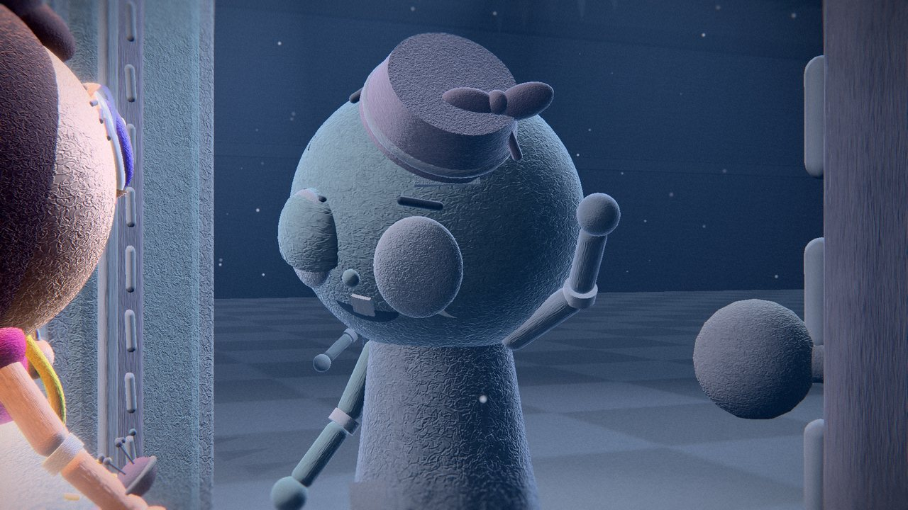<br><sub><b>0:25 · “…and they didn’t bite”.</b> The zombie at the door answers Pip by tipping its hat.<br><i>The cut to this view lands on the sung word, not on a typed time.</i></sub></td>
</tr>
<tr>
<td width="50%" valign="top">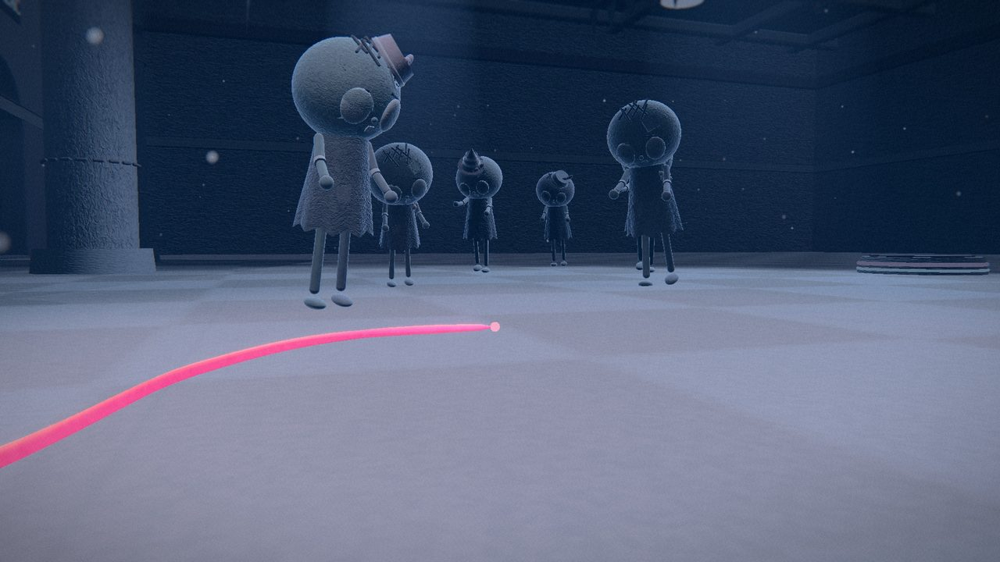<br><sub><b>0:30 · The thread runs.</b> A pink thread is pulled out of the machine and across the floor; the crowd turns to look.<br><i>A dashed pink thread band rides the edge of the front from here to the end of the film.</i></sub></td>
<td width="50%" valign="top">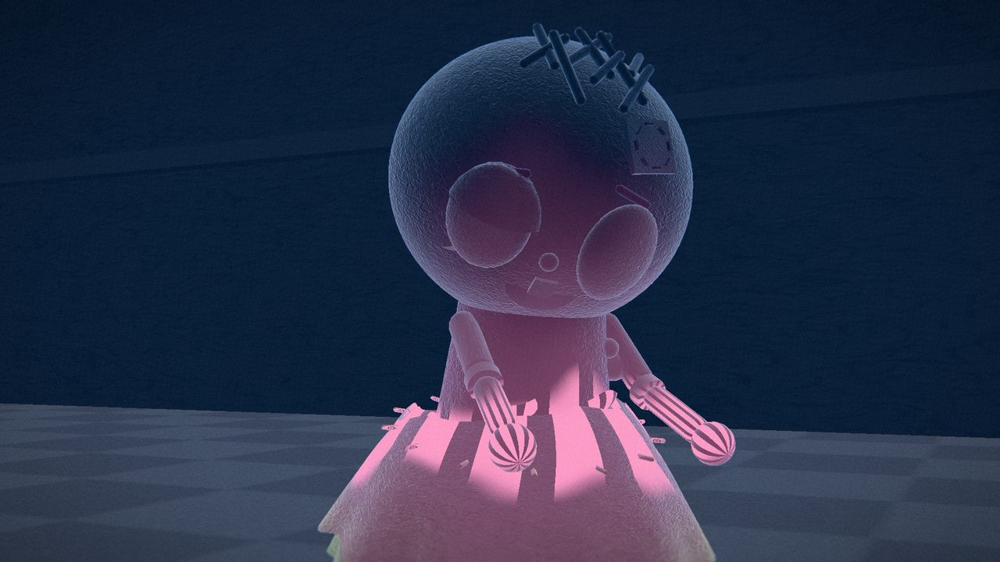<br><sub><b>0:40 · Sewn from the hem up.</b> Colour climbs a zombie from the feet while its top is still grey.<br><i>Every character has its own makeover value; the sweep threshold rises with height.</i></sub></td>
</tr>
<tr>
<td width="50%" valign="top">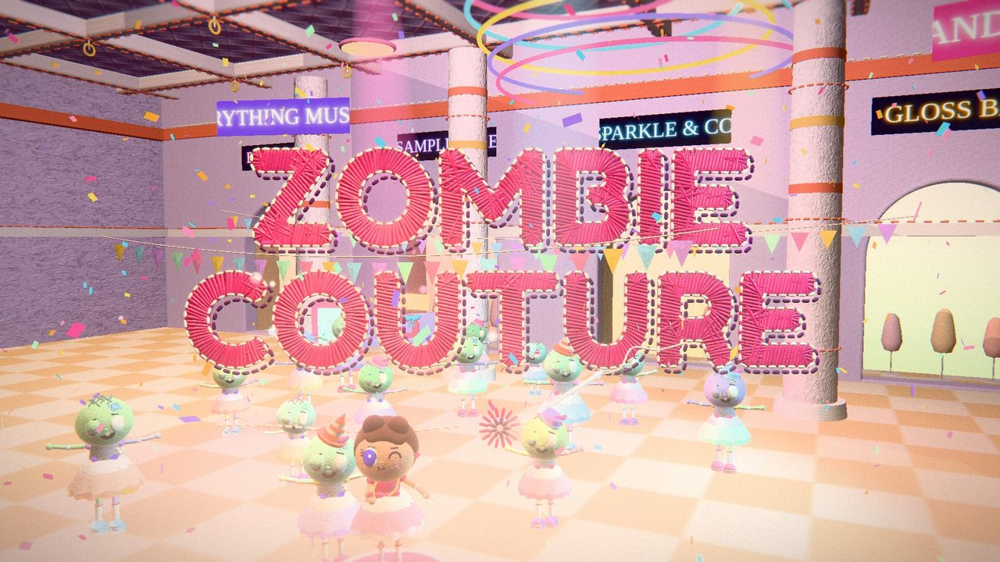<br><sub><b>0:50 · The title stitches itself.</b> “Zombie couture” embroiders itself across the air over the made-over crowd.<br><i>Each letter is filled with satin stitches that go in one at a time (<code>web/text.js</code>).</i></sub></td>
<td width="50%" valign="top">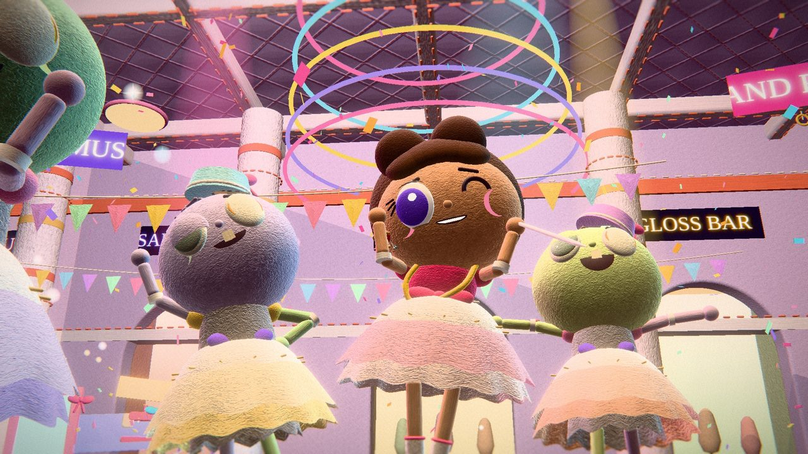<br><sub><b>0:51 · Hits on the beat.</b> A worm’s-eye view as Pip and two of her clients snap into a pose.<br><i>One pose hit per beat of the grid in the timing file.</i></sub></td>
</tr>
<tr>
<td width="50%" valign="top">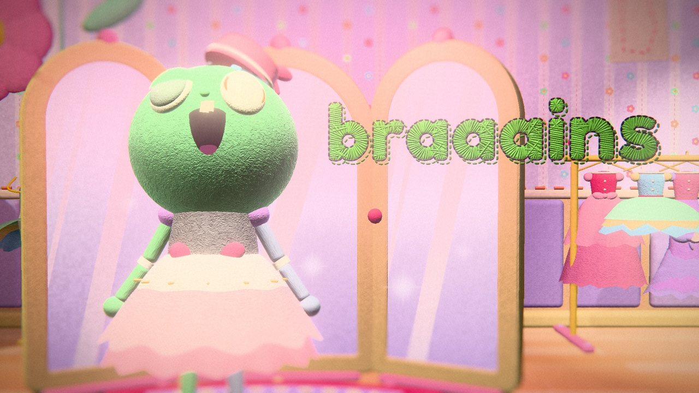<br><sub><b>1:17 · “braaains”.</b> The zombie moans, and the moan is embroidered beside it in green thread.</sub></td>
<td width="50%" valign="top">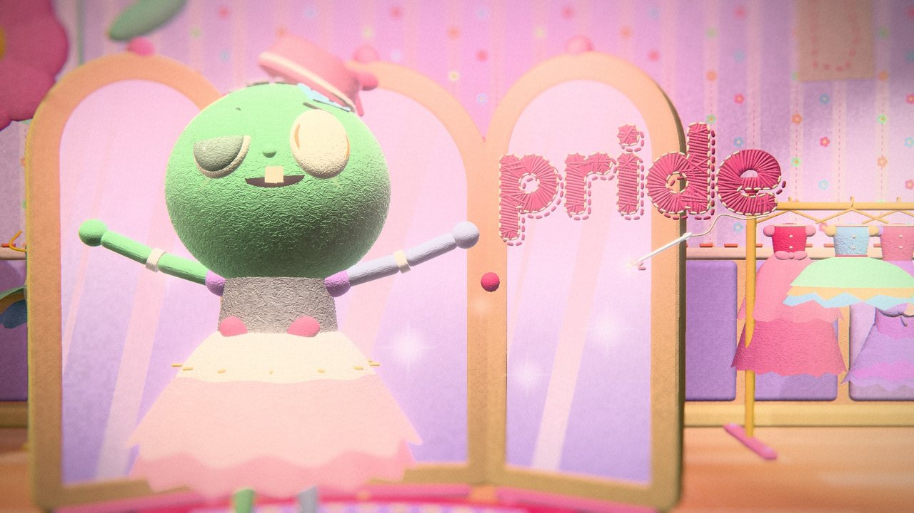<br><sub><b>1:19 · “pride”.</b> …then the word unpicks itself and is re-sewn in pink. Arms wide.<br><i><code>progress(p)</code> sews a word in, <code>unpick(p)</code> pulls it back out.</i></sub></td>
</tr>
<tr>
<td width="50%" valign="top">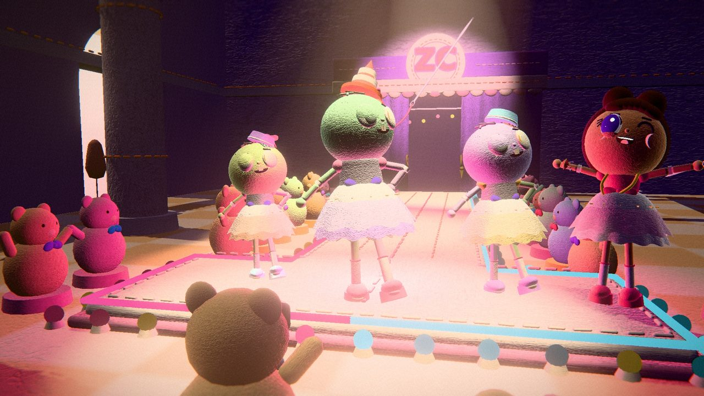<br><sub><b>1:27 · The runway.</b> Models in a cone of pink light, a teddy-bear audience, flashes from the photo pit.<br><i>Flashes are capped at three a second and checked by <code>tools/qa_frames.py</code>.</i></sub></td>
<td width="50%" valign="top">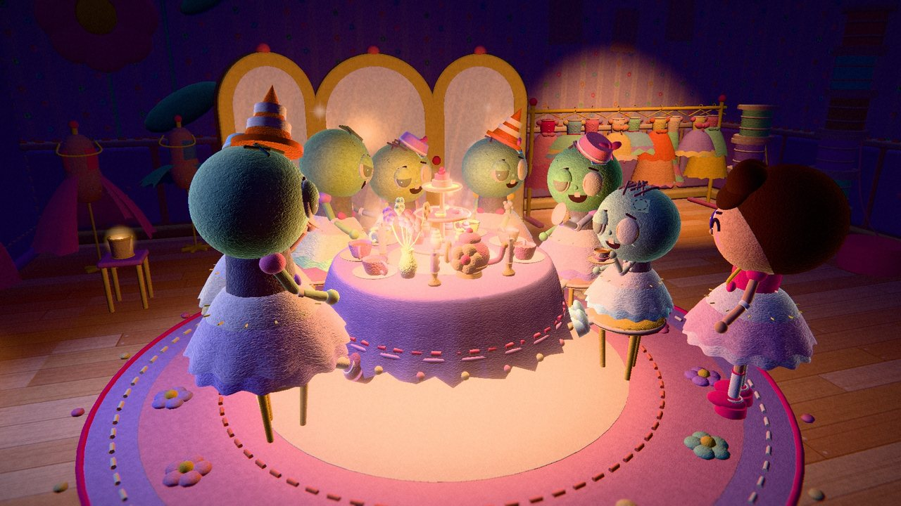<br><sub><b>1:58 · The tea party.</b> Dusk, candles, a stitched rug. The clientele wear party hats.<br><i>An arm is about to fall off; everyone ignores it.</i></sub></td>
</tr>
<tr>
<td width="50%" valign="top">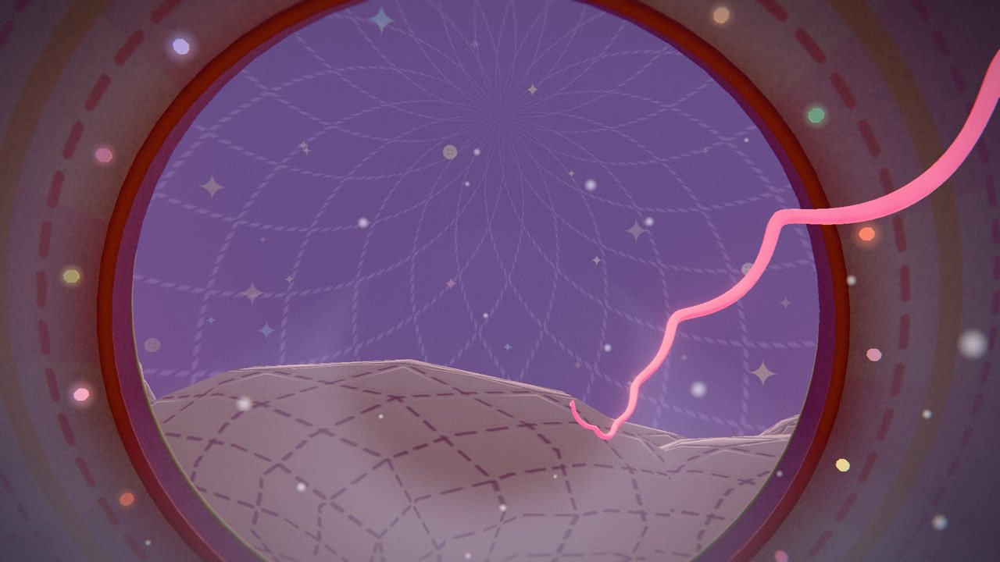<br><sub><b>2:06 · The thread climbs.</b> A line of pink light rises out through the round skylight into a dusk sky.</sub></td>
<td width="50%" valign="top">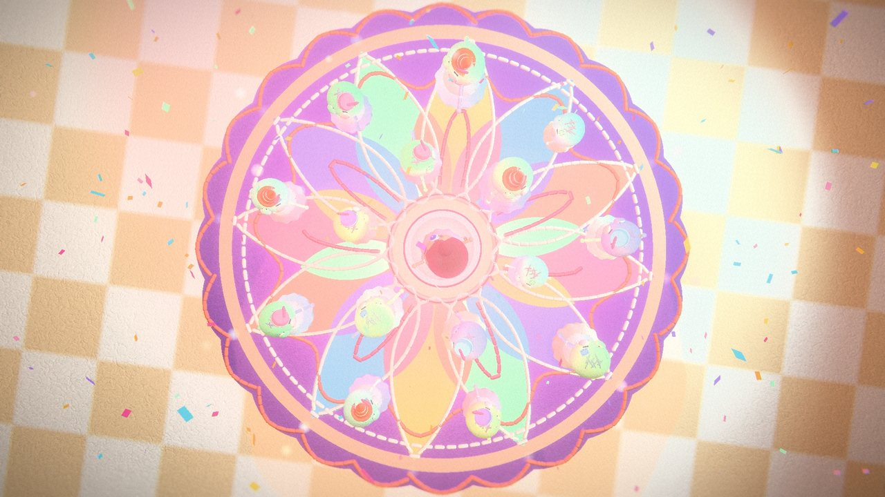<br><sub><b>2:24 · Overhead.</b> From straight above, the dolls make a flower on the floor.</sub></td>
</tr>
<tr>
<td width="50%" valign="top">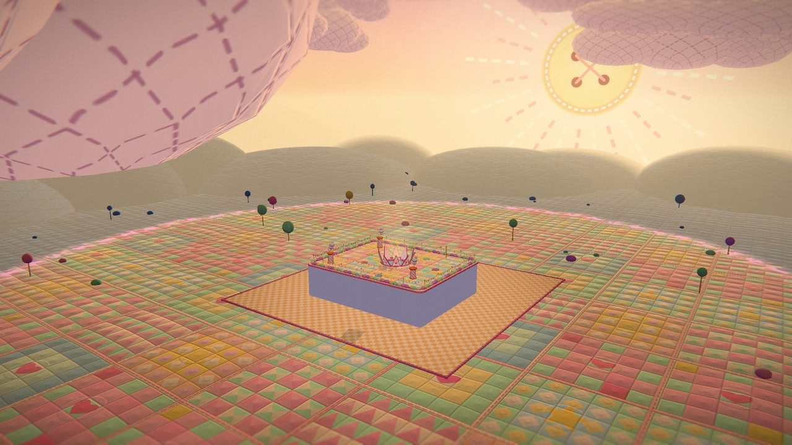<br><sub><b>2:38 · The crane-out.</b> The camera rises through the skylight until the mall is a small stitched box in an enormous quilt.</sub></td>
<td width="50%" valign="top">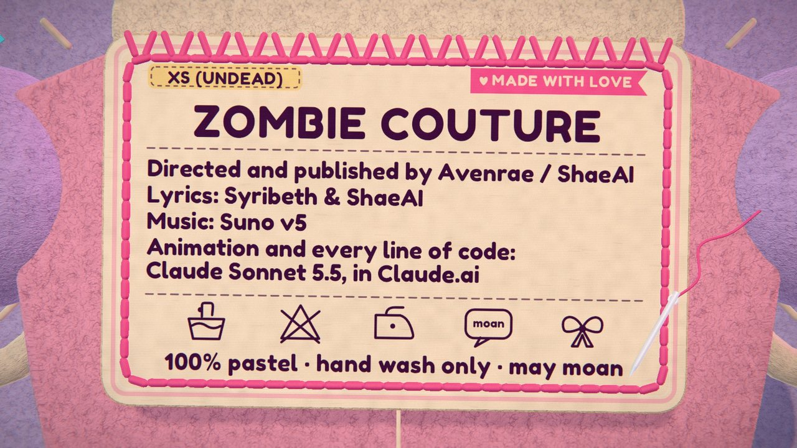<br><sub><b>2:56 · The care label.</b> The end card is a clothing label: size XS (undead), 100% pastel, hand wash only, may moan.</sub></td>
</tr>
</table>

## How it was made

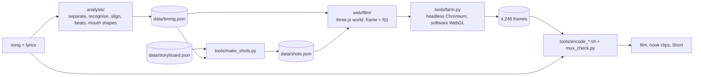

The long version, in the order the work happened, is in **[docs/MAKING_OF.md](docs/MAKING_OF.md)**. The short version is seven ideas.

**1. A frame is a function of time.** `window.setT(t)` draws the world at song time `t`. Nothing is carried from one frame to the next and nothing reads a clock or `Math.random`; noise comes from a hash. So any frame can be rendered alone, in any order, by any process: the farm can cut the film into pieces, a crashed render resumes where it stopped, and `tools/consistency.py` proves it by rendering the same instants ascending, after a jump and shuffled, then comparing bytes.

**2. One shader, two worlds.** Every material runs through `stitchify` (`web/stitch.js`). A moving front separates the dead world (cold, dim, blue-grey, fluorescent flicker) from the alive one (warm candy pastel), and a dashed pink thread band rides the boundary. Each character has its own makeover value and the sweep climbs the body from the feet up; gowns, bows and shoes are separate meshes discarded ahead of the sweep, with matching shadow materials, so a dress and its shadow appear together. Pip is never dead-graded: in verse 1 she is the only colour.

<table>
<tr>
<td width="50%" valign="top"><br><sub><b>Before.</b> The bridge opens on a door and a grey crowd.</sub></td>
<td width="50%" valign="top"><br><sub><b>After.</b> Same camera, same instant of the shot: a zigzag seam wipes across and the crowd is made over.</sub></td>
</tr>
</table>

**3. Felt without an image.** The wool fibre map, bump, mottling and the fresnel fuzz rim on the characters are generated in code (`web/mats.js`). Seams get blanket-stitch rings and the stitching on the floors is instanced 3D thread. The master is encoded at crf 20, picked from measurements, because fine fibres start to smooth at crf 24.

**4. Type that sews itself.** `web/text.js` rasterises each letter, takes an exact distance transform to find the direction across the stroke and fills it with satin stitches. `progress(p)` sews a word in, led by a bright needle-tip stitch; `unpick(p)` pulls the threads back out, which is how “braaains” becomes “pride”.

**5. The song becomes data, and the edit follows.** `analysis/` (vocal separation, speech recognition, word alignment, beat and downbeat tracking, mouth shapes from a pronunciation dictionary) turns a song and its lyrics into one JSON file. The edit is data too: `data/storyboard.json` says what happens at which line of the lyric, `tools/make_shots.py` resolves it against the timing into `data/shots.json`, and `tools/qa_shots.py` audits every cut against the beat grid. Mouths, caption stitching, pulses and cuts all read that one file.

**6. A render farm out of two CPU cores.** There is no GPU: three.js runs on software WebGL (SwiftShader) in headless Chromium, driven by Playwright. `tools/farm.py` renders with retries, browser restarts, heartbeat supervision and atomic writes, and the master was rendered from a frozen copy of the tree (`tools/snap.sh`) so edits could not reach a running render.

**7. Checks instead of hope.** `tools/qa_frames.py` flags blank, frozen, jumping and flashing frames; `tools/sheet_shots.py` makes contact sheets of every shot. When a neon sign turned out to be z-fighting its wall at some angles, `tools/signscan.py` found exactly which 1,127 of the 4,248 frames show a sign, and only those were rendered again (the story is in the making-of).

### Where to start reading

| To see | Read |
|---|---|
| the dead and alive worlds and the front between them | `web/stitch.js` (156 lines) |
| how one frame is built | `web/film/film.js` and `docs/FILM_RUNTIME.md` |
| the embroidery | `web/text.js` |
| how a cut is chosen | `tools/make_shots.py` and `docs/STORYBOARD_FORMAT.md` |
| how the words are timed to the vocal | `analysis/zcaudio/s3_align.py` and `analysis/README.md` |
| the render farm | `tools/farm.py` |

## Run it

Needs Node with npm (to fetch three.js r170), Python 3.10+, ffmpeg (for encodes only), and `pip install playwright numpy pillow scipy contourpy` followed by `playwright install chromium`. No GPU is needed or used.

```bash
npm install                                            # three.js

# one frame of the 10-second test scene (about 10 s with software WebGL)
python3 tools/shoot.py felt story out/test-scene.png 1280 720 "t=8.9"

# real sets from the film, rendered alone: the fitting room, then the mall dead and alive
python3 tools/shoot.py felt preview out/fitting-room.png 1280 720 "p=set&set=atelier&cast=pip@platform,z1@platformL&rig=fitWide&t=0.5"
python3 tools/shoot.py felt preview out/mall-dead.png    1280 720 "p=set&set=mall&rig=finale&alive=0&cast=pip@ped"
python3 tools/shoot.py felt preview out/mall-alive.png   1280 720 "p=set&set=mall&rig=finale&alive=1&cast=pip@ped"
```

<table>
<tr>
<td width="50%" valign="top">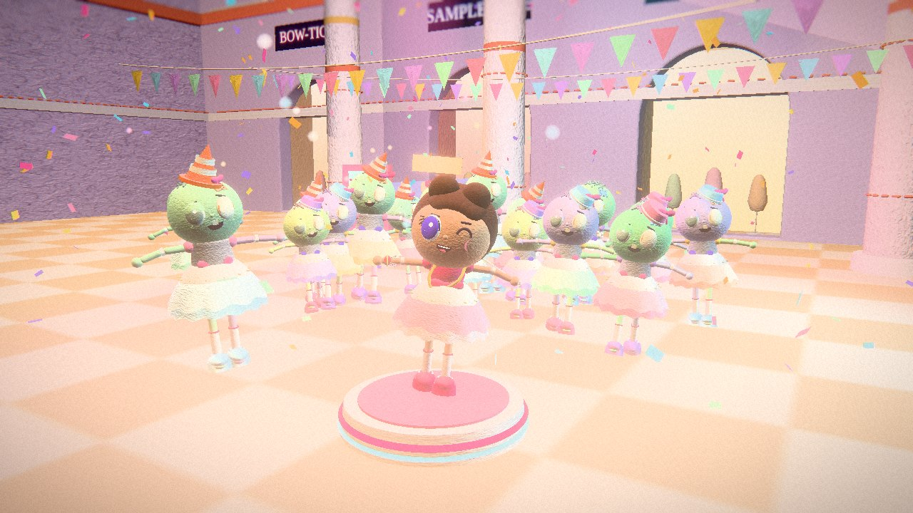<br><sub>The first command: the 10-second test scene at <code>t=8.9</code>.</sub></td>
<td width="50%" valign="top">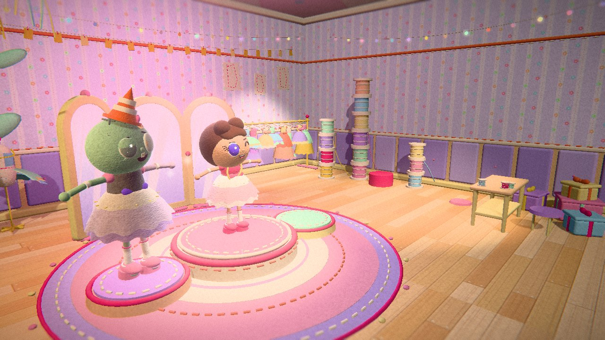<br><sub>The second: the fitting room from the film, a set rendered on its own.</sub></td>
</tr>
<tr>
<td width="50%" valign="top">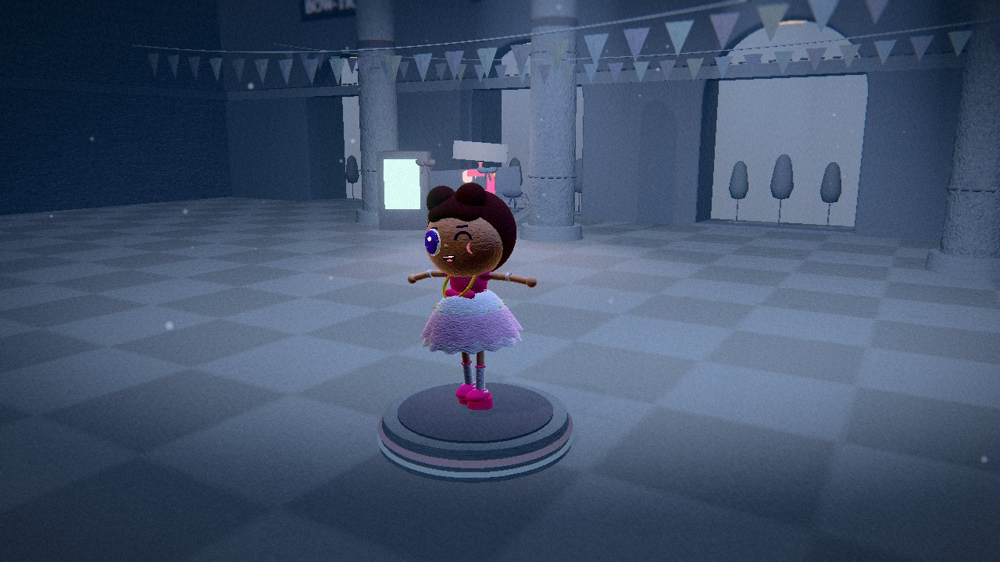<br><sub>The third: <code>alive=0</code>. Pip is never dead-graded.</sub></td>
<td width="50%" valign="top">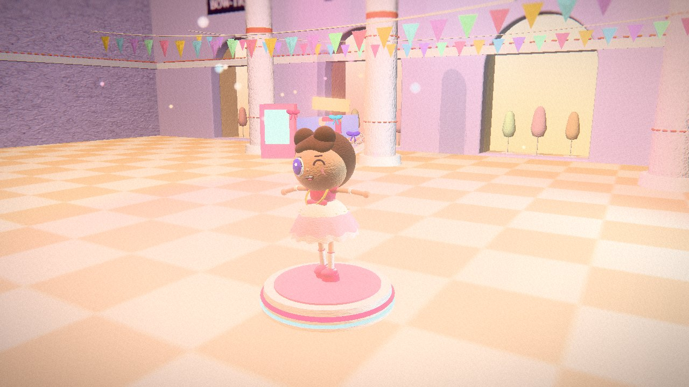<br><sub>The fourth: <code>alive=1</code>. Same scene, same camera, one switch.</sub></td>
</tr>
</table>

A 10-second clip of the test scene with a placeholder beat (`--on 2` renders every second frame and repeats it, "on twos"; the film itself renders every frame):

```bash
python3 tools/demo_track.py out/demo.wav
python3 tools/farm.py --scene story --t0 0 --t1 10 --fps 24 --on 2 --w 1280 --h 720 --out out/frames/test --fmt jpg
tools/encode_review.sh out/frames/test out/demo.wav out/test.mp4      # BT.709, one audio mux, faststart, then a pass/fail check
```

Software WebGL is slow: a 720p frame takes seconds, and the first frame of a page costs 8 to 13 s of shader compilation (`tools/shootmany.py` renders many views in one page load). The farm is resumable, so a crashed or stopped run continues where it stopped.

### What is not in this repository

The song, its lyrics, `data/timing.json` (it lists every sung word with its time) and the finished film are not part of the repository, so the full film cannot be rendered from a clone: `data/storyboard.json` resolves only against the real timing. The pipeline itself is not tied to this song: `analysis/run_audio.sh` takes any song and its lyrics, and `docs/PIPELINE.md` walks from an mp3 to rendered frames. The model weights that `analysis/` reads (the UVR-MDX-NET-Voc_FT vocal separator and the sherpa-onnx zipformer-gigaspeech recogniser) are not included; `analysis/README.md` says where they go.

## Repository map

```
web/        the world: scenes, materials, characters, faces, acting, text, gags, the light kit
  film/     film.js (the runtime behind setT), shots.js + shots2.js (the shot templates), timing.js
  sets/     the mall and its extensions, the fitting room, the sky and quilt world, the care label
analysis/   audio analysis: separate, recognise, align, beats, mouth shapes -> data/timing.json
tools/      edit resolver, render farm, encoders, QA checks, thumbnail, this repository's bundler
data/       storyboard.json (the edit as data) and shots.json (the resolved cuts)
docs/       treatment, engine notes, film contracts, pipeline, shot list, MAKING_OF.md
assets/     Fredoka One (the title font) and Barlow Condensed (the thumbnail label)
```

`docs/`: `MAKING_OF.md` (the long story), `TREATMENT.md` (story and look), `ENGINE.md` (files, tools, cost), `FILM.md` and `FILM_RUNTIME.md` (the contracts and the runtime), `SHOTLIST.md` (every shot as built), `STORYBOARD_FORMAT.md`, `TIMING_SCHEMA.md`, `PIPELINE.md`, `PUBLISHING.md` (frames to upload), `NEXT.md` (where the work stands, the farm commands, known soft spots and what was fixed late), `PRIOR_ART.md`.

## Credits

* Directed and published by Avenrae / ShaeAI
* Lyrics: Syribeth & ShaeAI
* Music: Suno v5
* Animation and every line of code: Claude Sonnet 5.5, in Claude.ai

## Licence

The code is MIT, see `LICENSE`. The fonts in `assets/` (Fredoka One for the film, Barlow Condensed for the thumbnail label) are under the SIL Open Font License 1.1 (`assets/OFL.txt`, `assets/OFL-BarlowCondensed.txt`). Other dependencies are listed in `THIRD_PARTY_NOTICES.md`. The song and the finished film are not part of this repository, and neither they nor the lyrics are covered by the MIT licence.
