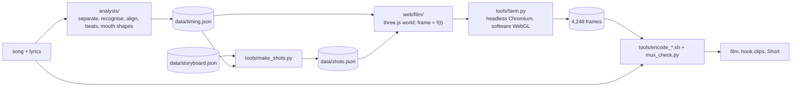
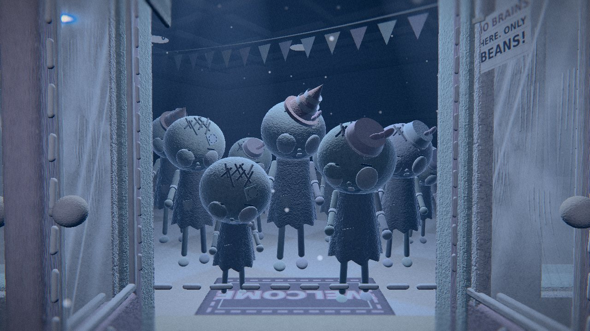
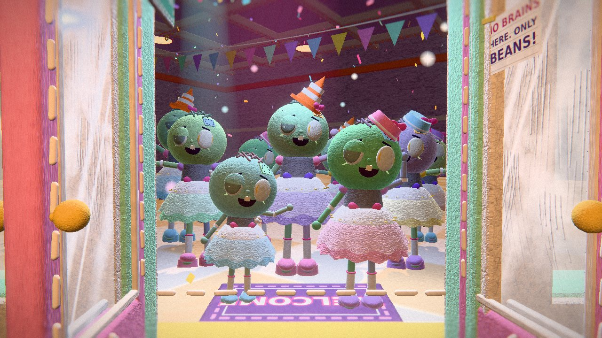
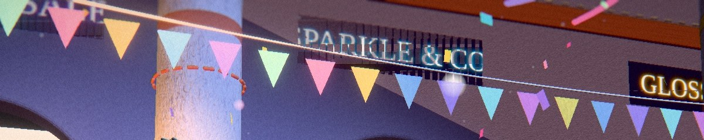
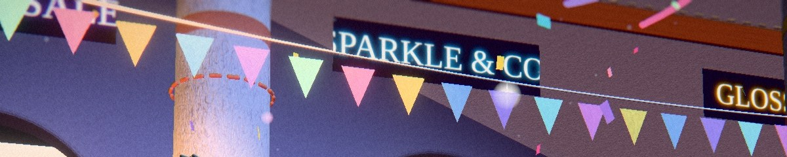

# Zombie Couture: how it was made

This is the long version of the README's "How it was made", in the order the work happened. File names are in `code` so you can jump to the source. Numbers are measured from the files and the renders, not estimated, unless a sentence says otherwise.



## Who did what

The song was made with Suno v5 and its lyrics are original; both are credited on the end card, and neither is in this repository. The film was directed and published by Avenrae / ShaeAI. The director picked the look, chose smooth 24 fps with every frame rendered, asked for a before/after "clientele" slider in the second half, and made every release decision. Claude Sonnet 5.5, in Claude.ai, wrote the treatment, every line of code, and rendered every frame.

To build in parallel, the work was cut into modules with written contracts (`docs/FILM.md`): the mall, the fitting room, the sky, the faces, the acting, the lettering, the gags, the edit pipeline, the publishing tools and the film runtime each had an owner for a handful of files, a fixed API, a frame budget (a set may add at most 0.6 s per frame at 720p to the shots it appears in) and a short report to hand back.

## The idea

A dead, grey, flickering mall is sewn back into colour by a pink stitch front that sweeps out from a sewing machine; every zombie it reaches is made over, hem first, into pastel couture. The lyrics say this in words; the picture does it in the material (`docs/TREATMENT.md`). That one decision explains most of the engine: the story is mostly not told by cutting between a "before" scene and an "after" scene, it is a boundary that moves through a single world.

## Rules before code

Four rules were written down for everyone who adds code (`docs/FILM.md`, section 0):

1. **A frame is a pure function of time.** `window.setT(t)` then `window.shoot()`. No `Date.now`, no `Math.random`, no state carried from frame to frame; noise comes from a hash (`web/util.js`).
2. **Build once, then only move things.** Per-frame code sets transforms, uniforms, visibility and instance matrices. It does not create geometry or materials.
3. **three.js r170 and nothing else, with no downloaded assets.** The only asset is one font (Fredoka One).
4. **Own your files.** A builder edits the files its brief names and nothing else.

The first rule is the one that pays for everything. Because any frame can be rendered alone, in any order, by any process, the render farm is simple, a crash costs one frame, and a late fix can re-render exactly the frames it touches. `tools/consistency.py` makes it a test: it renders the same instants in ascending order, after a jump to the end of the film and back, and shuffled, compares the PNG bytes, and fails on any difference.

Before building, a survey of 19 open-source AI-made music-video repositories (`docs/PRIOR_ART.md`) supplied ideas for the pipeline: the pure-function frame and a test for it, beat-snapped cuts, a flash limiter, frozen/blank/jump scans, chunked resumable renders with one audio mux. Ideas only: `THIRD_PARTY_NOTICES.md` lists what the project actually uses.

## The look: felt and thread

Chunky rounded forms, visible seams and running stitches, appliqué patches, buttons, ribbons, slightly imperfect symmetry, a wool-fibre surface and soft tilt-shift depth. The rule for every set was: never a plain CG box; if a shape is a box, round it, give it a stitched border, add a trim. The palette is candy pastel (pink `#ff9ecb`, lilac `#d9a7ff`, mint `#b6ffd6`, sky `#a8e6ff`, butter `#fff0a6`, peach `#ffc9a8`, cream `#fff4e0`), and one colour is kept for the heroine alone: Pip's hot pink `#ff2f86`.

None of the felt is a photograph. `web/mats.js` makes the fibre map and bump map in code, and the shader adds object-space mottling and a fresnel fuzz rim on the characters. Seams get blanket-stitch rings, and where the stitch front has passed the floors carry instanced 3D running stitches (`stitchPath` in `web/set.js`). Post is a tilt-shift band, a soft bloom and film grain (`web/post.js`). Grain is treated as a feature, which is why the encode ladder below matters.

The first plan was stop-motion "on twos" (12 poses a second). After seeing demos the director chose smooth 24 fps with every frame rendered ("Motion = ones"). The engine still has the twos and mixed modes (`motion=` in the film runtime), and the vinyl and paper looks that were mocked up for the treatment proposals are still selectable (`style=vinyl`, `paper=1`).

## One shader, two worlds

Every material is made by a factory (`web/mats.js`) and runs through `stitchify` (`web/stitch.js`), a patch to three.js's standard material. The patch knows about a front: a sphere, `uFront` (x, y, z, radius). Outside it the surface is dead: cold, dim, blue-grey, with a fluorescent flicker. Inside it the surface is alive: warm candy pastel under real lights and shadows. A dashed pink thread band rides the boundary. One global switch, `uAlive`, makes the whole world alive once the front has covered it.

Characters take a makeover value `K` from 0 to 1, and the sweep climbs from the feet up:

```glsl
return k * 1.2 - (0.02 + sh * 0.84 + sn * 0.07);   // sh = world height / 2.05, sn = noise; below 0 the pixel is not yet sewn
```

Gowns, bodices, bows and shoes are separate meshes flagged `sew`. They are discarded ahead of the sweep and carry a matching shadow depth material, so a dress and its shadow appear together. A zombie's `K` ramps over about 1.4 s as the front reaches it, with a hop and a sparkle pop when it completes. Pip's `K` is always 1: in verse 1 she is the only colour in the world.

The shot that shows both worlds at once is the bridge opening (`b_01`, `doorSlider`): the same door, the same camera and the same instant of the shot, with a zigzag-stitch seam wiping across the frame from the washed-out crowd to their made-over selves.

| Before | After |
|---|---|
|  |  |

Three.js r170 also bit once. Its bump mapping normalises screen-space derivatives with a plain `normalize()`; on a grazing pixel one of them can be exactly zero, the normal turns NaN, and the bloom blur then spreads that single NaN over a whole band of the frame (sometimes 75% of it). `web/stitch.js` patches the shader chunk before anything compiles and warns if three.js ever changes the chunk, and the first post pass is a second net for the bloom that follows (`web/post.js`).

## The cast

**Pip** is the designer and survivor who sings the lead: brown buns, a magenta streak, a purple iris, a wink, a tape measure, a pin cushion and a needle. **The zombies** come in seven variants (`ZV` in `web/cast.js`), no two alike: heights from 0.8 to 1.22 m, head scales from 0.9 to 1.18, pillbox hats, cone hats or none, stuffing tufts, patch colours. Dead, they have torn grey rags, bare feet and blank clouded eyes (a stitched X on some); made over, they have a gown (a lathe-turned skirt, a zigzag hem on half of them), a bodice, socks, shoes, bows and sewn-open eyes with iris, pupil and highlight. The film keeps a pool of Pip and 16 zombies.

Each doll has a handful of posable joints (body, head, shoulders, elbows, hips) and no fingers, so acting is arms, head, body, root bob and sway. `web/moves.js` holds 61 procedural acts: pure functions that take the time since the act began, the beat, a personal seed and an amplitude, and return a pose. The seed is why a crowd never moves in unison unless the act is meant to.

Mouths come from the song. `analysis/` turns every sung word into timed mouth shapes (eight classes: rest, MBP, FV, O, U, AA, EE, TLD, from a pronunciation dictionary plus letter-to-sound rules for anything it lacks), and `web/face.js` blends them on Pip's jaw and lips. Zombies open their mouths for a moan on the spans where the vocal contains sounds the lyrics do not explain, and mouth the gang-vocal hook lines. Blinks and gaze are deterministic schedules, not random.

## Sets, and a light kit that never recompiles

All the sets live in one three.js scene at different coordinates and are built once: the mall atrium with five extension modules (the shop door, the runway, the rosette floor, the roof and the sewing-machine macro set), the fitting room (`atelier`, built 73 to 87 m along the x axis), a sky-and-quilt world inside a dome of radius 380 m, and the care-label end card. A shot only shows and hides groups.

The lights are the same ten in every shot: one directional key (the only light that casts shadows), one hemisphere light, six spots and two points. A set configures them in `light(kit, u, c2)`; it never adds one. The reason is practical. Adding or removing a light, or switching shadows on a light, makes three.js recompile every material, a stall on the first frame after a cut. In the roof finale the key therefore always casts: as the camera climbs above 30 m its shadow box just closes down, and for the sky world it sits 700 m up in empty space. Lamps, candles and neon are emissive materials and additive beam meshes rather than extra lights.

## The song becomes data

`analysis/run_audio.sh song.mp3` runs nine stages on the CPU and writes one file, `data/timing.json` (schema in `docs/TIMING_SCHEMA.md`):

| stage | what it does |
|---|---|
| normalize | decode to 44.1 kHz stereo; a hash of the samples keys every cache |
| separate | MDX-Net vocal/instrumental split (UVR-MDX-NET-Voc_FT), by far the slowest stage |
| asr | sherpa-onnx zipformer recognises the words in the vocal stem, to 40 ms |
| align | a dynamic program aligns the written lyrics to the recognised words; misheard, dropped and extra words only cost a little |
| beats | onset envelopes, tempo, a beat tracker that follows drift, then the downbeat by a vote of harmonic change, bass, loudness, kick and backbeat |
| features | five band levels, onset strength, vocal level, kick/clap/hat times |
| visemes | pronunciations to mouth shapes, timed inside each word |
| timing, sheet | assemble and validate the JSON; write a PNG and an HTML player for checking |

On the real song: 126.18 BPM, first downbeat at 0.413 s, beat confidence 0.94 and downbeat confidence 1.0, 10 sections. Of the 242 lyric words, 198 were matched to recognised words, 43 were placed between them along the voiced stretches of the vocal, and one was pinned by hand in `data/overrides.json`. The generated `sheet.html` is a player with a karaoke line and a bar counter, and it can write the overrides file for you: you listen, click "t0 = now" next to a word, and re-run two cheap stages. Corrections are never made in `timing.json` itself.

The film reads the file through `web/film/timing.js`, which turns the schema's reference code into methods (`beatAt`, `wordAt`, `mouth(t)`, `moan(t)`, `sing(t)`, ...). Nothing else in the film may hard-code a time.

## The edit is data too

`data/storyboard.json` is the plan: sections, shots, and for each shot a template, a cast, anchors ("at the first word of line 3 of chorus 1"), and how much room it wants. `tools/make_shots.py` resolves it against the timing into `data/shots.json`: the 81 shots, each with exact start and end times, a transition, and a cost class. Free cuts land on whole beats; a cut that a word forces keeps the word's exact time. Of the 80 cuts, 28 land within 20 ms of a beat (13 of them on a downbeat) and the other 52 are placed on an exact sung-word time; none is off the music. `tools/qa_shots.py` then audits them: no cut more than 20 ms from a beat unless a word explains it, no plain cut inside a word held for more than 0.6 s, no more than three flashes in any second.

The shot templates (`web/film/shots.js` and `shots2.js`, 75 of them in use) are pure functions that say which set is visible, which camera rig, who stands where doing which act, which light preset. A shot's length comes from what it must say, not the other way round: choruses average about 1.9 to 2.4 s a shot, verse 2 about 2.1 s, the bridge 2.7 s. `docs/SHOTLIST.md` describes every shot template as built.

Because the cut list is derived, re-timing is cheap: a new `timing.json` re-cuts the whole film (run `tools/make_shots.py` and the checks again), and the contact-sheet cache notices which shots changed and renders only those.

## Type that sews itself, and the gags

`web/text.js` makes the embroidered title and the captions. Each letter is rasterised, an exact distance transform (Felzenszwalb) gives the direction across the stroke at every point, and a satin fill lays threads across it. `progress(p)` stitches a word in, in reading order, led by a bright needle-tip stitch; `unpick(p)` pulls the threads back out with loose ends that curl and fall. Chained, they are the verse 2 gag: the zombie moans, "braaains" is embroidered beside it in green, the word unpicks itself, and "pride" is sewn in pink.

`web/gags.js` holds the other jokes: the last can of beans, and the loose arm at the tea party that falls off, is ignored by everyone, and is sewn back on by Pip with a bow. That one needed a camera study. Pip's head is huge relative to the table, so any camera between her and the seated zombie is filled by her face during the stoop and the carry. After trying inside the horseshoe, high, behind, east, south and south-west, what works is a wider camera from the south-west where the whole beat reads, and a high two-shot from the far side for the stitching (`docs/NEXT.md`).

## Rendering on two CPU cores

There is no GPU. Playwright drives headless Chromium with three.js on software WebGL (SwiftShader). A 1080p frame of the finished film costs about 7 to 12 s on two shared cores, and 12 to 17 s when an encode or a test render shares them, so the master is an overnight job. Cost follows draw calls, geometry and shadow-map size more than pixels: 2.25 times the pixels cost 1.66 times the time.

`tools/farm.py` is the render farm: resumable (frames that exist and are intact are skipped), shardable, and supervised, with retries, browser restarts, a heartbeat and atomic writes, so a killed run never leaves a half frame. The master was rendered in two passes as shots were finished, from a frozen copy of the tree (`tools/snap.sh`, which runs a smoke test first) so that editing the code could never reach a running render. The machine rebooted once during the second pass; everything stopped, the files were intact, and the driver started again where it had stopped. A rule that kept the render honest: never change the behaviour of a shot that already has frames, because its frames would no longer match the rest; if a shot must change, delete its frames and let the farm render them again.

## Checking the work, and what it found

Checking is a pipeline of its own. `tools/sheet_shots.py` renders three frames of every shot as labelled contact sheets. `tools/qa_frames.py` scans the rendered frames for blank, frozen, jumping and flashing stretches, excusing the cuts the shot list plans (the 28 jumps it still flags are designed, such as the intro's flickering vending machine). Every shot's first, middle and last frame are also looked at by eye. Four things that were found:

* **A pop in the middle of a camera move.** `pipListen` had a one-frame jump at 13.71 s: the camera started on the far side of a wall of the door module, which filled the right of the frame and vanished when the camera crossed it (single-sided geometry). The push-in now stays on one side. Lesson: look at the middle of a move, not only its ends.
* **A joke hidden by a head.** In `noBite` the camera stood behind Pip, whose head hid the zombie's lean and its hat tip. It moved to the concourse over the zombie's shoulder, and because the hat-tip arm then crossed Pip's eye, the shot cuts to a front view of the zombie's face on the word "bite."
* **Type that fits in landscape but not in portrait.** The vertical Short is rendered in portrait, not cropped (below). In it the embroidered title at its landscape scale of 1.5 cut COUTURE off at both sides; in portrait it is scaled to 1.15. Found only by looking at the finished Short frame by frame.
* **Neon signs that flickered.** The five sign planes in `web/set.js` lay exactly on the wall's front face, so at oblique angles the two surfaces z-fought, frame by frame: the lettering came out half drawn or riddled with dropouts. It showed up in the Short, where the camera sits close under a sign. The fix is a polygon offset on the sign material, which changes depth only, so every frame without a sign is identical to before. `tools/signscan.py` lists the frames where a sign is on screen (1,127 of 4,248 in the film), exactly those were rendered again from a snapshot with the fix, and 290 of them came out bit-identical because the sign had not fought in them. `tools/zfight_audit.py` is the static check that finds coplanar overlapping triangles without rendering anything.

| Before (frame 989, 0:41) | After (same frame) |
|---|---|
|  |  |

Frames are deterministic: a second render of the same frame is bit-identical, so the glitch was in the content and not in the render. That is also what made the fix cheap. The other 3,121 frames of the corrected film are hard links to the originals.

## Finishing

The encode ladder was set from measurements on 72-frame samples of three stretches (`docs/NEXT.md`): at 1080p, crf 16 is 42 to 66 Mbps (about 1 GB for the film), crf 20 is 20 to 35 Mbps (about 550 MB), crf 24 is 7 to 16 Mbps and starts to smooth the fine fibres, crf 28 is clearly soft. The release is therefore 1080p at crf 20, tagged BT.709, with the audio muxed once and padded to the picture length (never `-shortest`); `tools/mux_check.py` then checks the frame count, colour tags, frame rate, audio length against the song, `faststart` and the metadata before anything is uploaded.

The 15-second hook is the four chorus lines of chorus 1, frames 899 to 1261 (363 frames). The widescreen version reuses the finished frames. The vertical 9:16 Short is rendered again, natively in portrait, with the camera re-framed per shot (`?pz=` and `?short=` in the film runtime, numbers in `data/short.json`), because a crop of the widescreen picture leaves the subjects small.

The thumbnail (`tools/thumbnail.py`) is a lossless render of frame 1,205, the embroidered title, with a swallow-tail ribbon and a sewn label composed on top in PIL. The captions, the description and the upload kit are generated by `tools/make_srt.py`, `tools/make_description.py` and `tools/make_kit.py` from the same data.

## What is still soft

* A few early shots (`beansCU`, `cloudyEyes`, `pipBack`, `scratchCU`) have small weaknesses, such as the legibility of the bean can's label; their frames would have to be deleted and re-rendered to change them.
* Faces are small in wide shots. The performance lives in the close-ups and the mouth rig.
* Chorus shots average 1.9 to 2.4 s against a target of 1.7 to 1.9 s, because the lyric lines are long held notes.
* The edit follows this song's lyrics line by line, so `data/storyboard.json` cannot be reused for another song without rewriting it. The engine, the analysis and the tools can.

## Try the engine

The README's "Run it" renders the test scene, a real set from the film, and the mall dead and alive, from a fresh clone with no song. `docs/PIPELINE.md` is the walk from an mp3 to rendered frames, `docs/FILM.md` and `docs/FILM_RUNTIME.md` are the contracts if you want to add a shot, and `docs/NEXT.md` holds the farm commands and the checklist from frames to upload.
